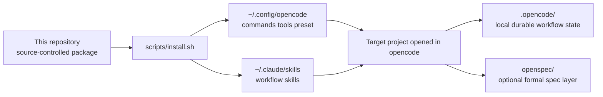
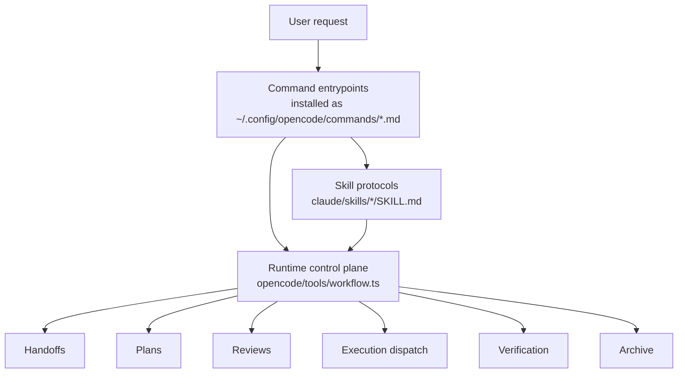
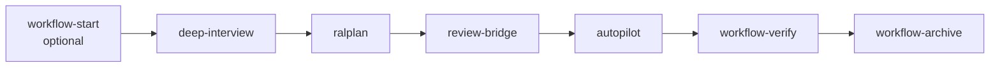
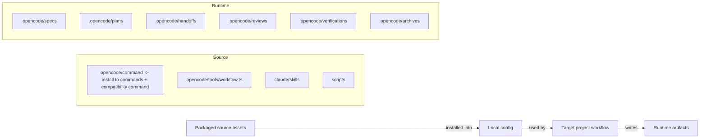

# Resumable Agent Workflow

GitHub-ready packaging repo for an artifact-backed multi-agent workflow stack with durable recovery.

## At A Glance

- installable local workflow package for `opencode` and Claude skills
- artifact-first multi-stage agent pipeline with resumable state
- thin-orchestrator architecture with delegated specialist phases
- local durable store under `.opencode/` inside each target project
- Linux-first install flow with one-command setup and verification

## Why This Project Is Different

Most agent setups are easy to start but hard to resume cleanly.

This project is optimized for workflows where you want:

- durable state instead of chat-only progress
- explicit planning, review, execution, verification, and archive stages
- handoff artifacts that survive interruptions
- runtime-enforced workflow contracts instead of prompt-only conventions
- a reusable local installation that can be applied to many target repositories

## Feature Snapshot

| Capability | What it gives you |
| ---------- | ----------------- |
| Durable artifacts | Specs, plans, reviews, verification, and archive records written to disk |
| Resumable sessions | Workflow progress can continue from saved state rather than restarting from chat |
| Runtime control plane | `opencode/tools/workflow.ts` enforces state transitions and artifact contracts |
| Stage-specialized skills | Each phase uses dedicated behavior contracts instead of one generic prompt |
| Review-gated execution | Execution can be routed through formal planning and review before coding starts |
| One-command install | Packaged commands, tools, presets, and skills can be copied into a local environment |

## Who This Is For

This repo is a good fit if you want to:

- package your own local OpenCode workflow stack into a shareable GitHub repository
- use durable local artifacts as a workflow backbone
- standardize multi-phase agent work across multiple projects
- keep execution quality gates visible instead of implicit

This repo is probably not the best fit if you only want:

- a single prompt file
- a minimal one-agent coding setup
- a cloud-hosted orchestration service
- a cross-platform installer on day one

This repository packages a local workflow system built around three ideas:

- a thin orchestrator instead of one overloaded agent
- fresh-context specialist agents for each phase
- durable workflow artifacts on disk so progress can be resumed, validated, reviewed, and archived

It is designed to be installed into your local OpenCode and Claude environment, then used from inside any target project.

## What This Repo Contains

This repository is the source-of-truth bundle for:

- OpenCode command files
- runtime helpers and workflow state-machine tools
- Claude skill definitions for each stage
- install and verification scripts
- documentation for using the workflow in real projects

In practice, this means:

- this repo is the package you version and push to GitHub
- your installed config lives in your local home directory
- each target project gets its own local workflow artifacts under `.opencode/`

## What Problem It Solves

Normal agent workflows often lose context because progress lives mostly in chat history.

This stack pushes the important state into local artifacts instead:

- specs
- planning outputs
- handoffs
- review decisions
- execution dispatch ledgers
- verification results
- archive records

That gives you a workflow that is easier to:

- resume after interruption
- inspect and audit
- hand off between stages
- validate automatically
- continue without manually restating the whole task

## Core Workflow

Typical stage flow:

```text
workflow-start (optional)
-> deep-interview
-> ralplan
-> review-bridge
-> autopilot
-> workflow-verify
-> workflow-archive
```

Stage responsibilities:

- `workflow-start`
  - optional startup lane
  - gathers lightweight local context
  - produces a startup brief and confirmation checkpoint
- `deep-interview`
  - clarifies vague requests with ambiguity-scored questioning
  - writes a runtime spec and initial handoff
- `ralplan`
  - produces a consensus implementation plan
  - prepares the workflow for review
- `review-bridge`
  - applies a local review gate before execution
- `autopilot`
  - executes approved work using dispatchable subagent tasks
- `workflow-verify`
  - validates post-execution outputs
- `workflow-archive`
  - writes the final closure artifact

## Architecture Overview

### Packaging And Runtime Topology



What this means:

- this repo is the package you publish and version
- local config directories hold reusable command, tool, and skill assets
- each target project gets its own isolated runtime state under `.opencode/`
- execution history is not trapped in chat; it is materialized as local artifacts

### Control Plane Architecture



This separation is intentional:

- command files define entrypoints and routing rules
- skill files define reasoning and stage behavior
- `opencode/tools/workflow.ts` is the actual runtime control plane and state machine
- artifacts are the durable source of truth across stages

### Phase DAG



## Runtime Model

This workflow uses a split model:

- global reusable assets are installed into your local config directories
- per-project workflow state is written into the project you are currently working in

That separation looks like this:

```text
Global install:
- ~/.config/opencode/
- ~/.claude/skills/

Per-project runtime state:
- .opencode/
- openspec/         (when the target project uses OpenSpec)
```

The default local durable store policy is project-local, filesystem-backed, and durable under `.opencode/`.

## Constraints And Guarantees

This workflow is opinionated by design. The architecture does not only enable behavior; it also constrains it.

### Main Constraints

- durable-artifact-first
  - specs, handoffs, reviews, execution state, verification, and archive records should live on disk
  - chat context is not treated as the only source of truth
- runtime-wrapper-first
  - major stages should go through runtime helpers before doing free-form execution
  - this keeps session state, transitions, and terminal outputs coherent
- thin orchestrator
  - the parent flow coordinates stages and delegates work instead of becoming the primary worker
- fresh-context specialists
  - specialist agents should work from sealed context packets and durable artifacts, not ambient chat reconstruction
- review-gated execution
  - execution should not silently skip approval or review requirements when the workflow says review is required
- project-local durability
  - target-project workflow state belongs in `.opencode/`, not mixed into global config or hidden only in memory
- explicit terminal closure
  - runs should end with verification and archive stages instead of stopping at “code is written”
- Linux-first packaging
  - the current installer is intentionally scoped to Linux for the first release

### Practical Guarantees

If the workflow is used as intended, it aims to provide:

- resumability after interruption
- inspectable artifact lineage between phases
- explicit handoff and approval state
- auditable execution and dispatch history
- consistent continuation between planning, review, execution, verification, and archive
- clearer separation between packaged source assets and generated runtime state

### Source Of Truth Boundaries



Boundary rules:

- package assets in this repository are versioned source
- installed assets in local config are deployment copies
- `.opencode/` in target projects is runtime output
- runtime output should usually not be maintained as source in this packaging repo

## Current Scope

Current release assumptions:

- Linux-first install flow
- clone the repository, then run one installer script
- success means commands and default configuration are usable after one run

Not in scope for the first version:

- Windows install support
- full cross-platform packaging
- treating runtime-generated `.opencode/` artifacts as curated source files

## Prerequisites

Before installing, make sure these binaries are available in your shell:

- `bun`
- `jq`
- `opencode`

You can verify them quickly with:

```bash
command -v bun jq opencode
```

## Quick Start

Clone the repo:

```bash
git clone <your-repo-url>
cd <repo-dir>
```

Replace `<repo-dir>` with the directory name you actually cloned into.

Install into your local environment:

```bash
bash scripts/install.sh
```

Verify the installation:

```bash
bash scripts/verify-install.sh
```

After that, open a target project in `opencode` and initialize the local workflow store:

```text
/workflow-init
/workflow-check
```

`/workflow-init` now also bootstraps `openspec/` with `openspec init --tools opencode .` when the current workspace has not been initialized yet and the `openspec` binary is available. If OpenSpec is already present, it leaves the workspace as-is.

## Custom Install Paths

By default, the installer writes to:

- `~/.config/opencode/`
- `~/.claude/skills/`

You can override those targets:

```bash
OPENCODE_DIR=/custom/opencode \
CLAUDE_DIR=/custom/claude \
bash scripts/install.sh
```

The same variables also work with the verification script:

```bash
OPENCODE_DIR=/custom/opencode \
CLAUDE_DIR=/custom/claude \
bash scripts/verify-install.sh
```

## What Gets Installed

The installer currently copies:

- `opencode/command/` -> `$OPENCODE_DIR/commands/` (primary)
- `opencode/command/` -> `$OPENCODE_DIR/command/` (compatibility mirror during transition)
- `opencode/tools/` -> `$OPENCODE_DIR/tools/`
- `opencode/docs/` -> `$OPENCODE_DIR/docs/`
- `opencode/oh-my-opencode-slim.json` -> `$OPENCODE_DIR/oh-my-opencode-slim.json`
- `claude/skills/` -> `$CLAUDE_DIR/skills/`

This repo is a copy-based packaging repo, not a symlink-based live setup.

## Verification Modes

There are two useful verification paths:

- repository-only check
  - validates that the repo contains the required packaging assets
- installed-layout check
  - validates the copied files in the target config directories

Repository-only verification:

```bash
bash scripts/verify-install.sh --repo-only
```

Equivalent package script:

```bash
npm run verify:repo
```

Installed-layout verification:

```bash
bash scripts/verify-install.sh
```

Workflow runtime smoke coverage:

```bash
npm run verify:smoke
```

## Using It In Another Project

Once installed, go to a target project and launch `opencode` there:

```bash
cd /path/to/your/project
opencode
```

Recommended startup flow inside the target project:

```text
/workflow-init
/workflow-check summary
/deep-interview "我要做一个新的功能"
```

Alternative entry paths:

- if the request is vague, start with `deep-interview`
- if you want a startup brief first, use `workflow-start`
- if you already have a clear plan, begin at `ralplan`
- if you already have an approved artifact, go to `autopilot`

## Common Command Paths

Typical commands you will use after install:

- `/workflow-init`
  - creates the local `.opencode/` runtime directories in the current project
- `/workflow-check`
  - checks workflow health, artifact consistency, and runtime drift
- `/workflow-start "..."`
  - creates a startup brief with confirmation before deeper routing
- `/deep-interview "..."`
  - clarifies vague requests into a durable runtime spec and handoff
- `/ralplan`
  - creates a consensus plan
- `/review-bridge`
  - applies a review gate before execution
- `/autopilot`
  - executes approved work
- `/workflow-verify`
  - verifies execution output
- `/workflow-archive`
  - archives and closes the run

## Durable Artifact Layout In Target Projects

When the workflow runs inside a target repository, it writes local artifacts such as:

```text
.opencode/specs/
.opencode/plans/
.opencode/executions/
.opencode/executions/results/
.opencode/handoffs/
.opencode/reviews/
.opencode/verifications/
.opencode/archives/
.opencode/context/
.opencode/state/
.opencode/sessions/
```

These are runtime artifacts, not the source package itself.

That is why this packaging repo ignores its own `.opencode/` directory in git.

## Repository Layout

```text
resumable-agent-workflow/
├── README.md
├── .gitignore
├── package.json
├── tsconfig.json
├── scripts/
│   ├── install.sh
│   └── verify-install.sh
├── opencode/
│   ├── command/
│   │   ├── autopilot.md
│   │   ├── deep-interview.md
│   │   ├── ralplan.md
│   │   ├── review-bridge.md
│   │   ├── workflow-archive.md
│   │   ├── workflow-check.md
│   │   ├── workflow-e2e-smoke.md
│   │   ├── workflow-init.md
│   │   ├── workflow-start.md
│   │   ├── workflow-startup-smoke.md
│   │   ├── workflow-validate.md
│   │   └── workflow-verify.md
│   ├── docs/
│   │   └── workflow-usage.md
│   ├── tools/
│   │   └── workflow.ts
│   └── oh-my-opencode-slim.json
└── claude/
    └── skills/
        ├── autopilot/
        │   └── SKILL.md
        ├── deep-interview/
        │   └── SKILL.md
        ├── ralplan/
        │   └── SKILL.md
        └── review-bridge/
            └── SKILL.md
```

## Key Files Explained

- `opencode/tools/workflow.ts`
  - the runtime control plane
  - defines workflow artifact contracts, session behavior, validation, dispatch handling, verification, and archive logic
- `opencode/command/*.md`
  - packaged workflow command entrypoints; installer publishes them into `~/.config/opencode/commands/` and a compatibility `command/` mirror
- `claude/skills/*/SKILL.md`
  - phase-specific reasoning and execution contracts for specialist agents
- `scripts/install.sh`
  - one-command installer for copying the package into your local config directories
- `scripts/verify-install.sh`
  - checks both repo completeness and installed layout correctness
- `opencode/docs/workflow-usage.md`
  - a more usage-oriented guide for running the workflow in real projects

## Development Notes

If you change any of these, reinstall or copy them again into your local config:

- `opencode/command/*.md`
- `opencode/tools/workflow.ts`
- `opencode/docs/workflow-usage.md`
- `claude/skills/*/SKILL.md`
- `opencode/oh-my-opencode-slim.json`

Recommended local development loop:

```bash
npm run verify:repo
npm run verify:smoke
bash scripts/install.sh
bash scripts/verify-install.sh
```

If `opencode` is already running while you update command or skill files, restart it so command and skill text reloads cleanly.

## Publishing To GitHub

This repository is now structured to be pushed as a normal GitHub project.

Typical steps:

```bash
git init
git add .
git commit -m "Initial workflow packaging repo"
git branch -M main
git remote add origin <your-repo-url>
git push -u origin main
```

Before publishing, you may also want to add:

- a `LICENSE`
- a GitHub Actions workflow
- release notes or tags
- screenshots or example workflow transcripts

## Troubleshooting

### `Missing required binary`

The installer and verifier require `bun`, `jq`, and `opencode`. Make sure they are in `PATH`.

### Commands do not appear after install

Check the actual install target paths:

```bash
echo "$OPENCODE_DIR"
echo "$CLAUDE_DIR"
```

If you did not override them, the defaults are `~/.config/opencode` and `~/.claude`.

Then rerun:

```bash
bash scripts/verify-install.sh
```

### Workflow health check fails in a target project

Inside the target project, make sure you ran:

```text
/workflow-init
```

Then rerun:

```text
/workflow-check
```

### Updated command or skill files are not taking effect

Reinstall the package and restart `opencode`.

## License

MIT. See `LICENSE`.

## Design Philosophy

- The orchestrator should coordinate, not become the main worker.
- Real work should be delegated to fresh-context specialists.
- Durable artifacts should outrank chat history as the source of truth.
- Queued states should stay flexible.
- In-progress states must be explainable and traceable.
- Terminal states must stay strict and auditable.
